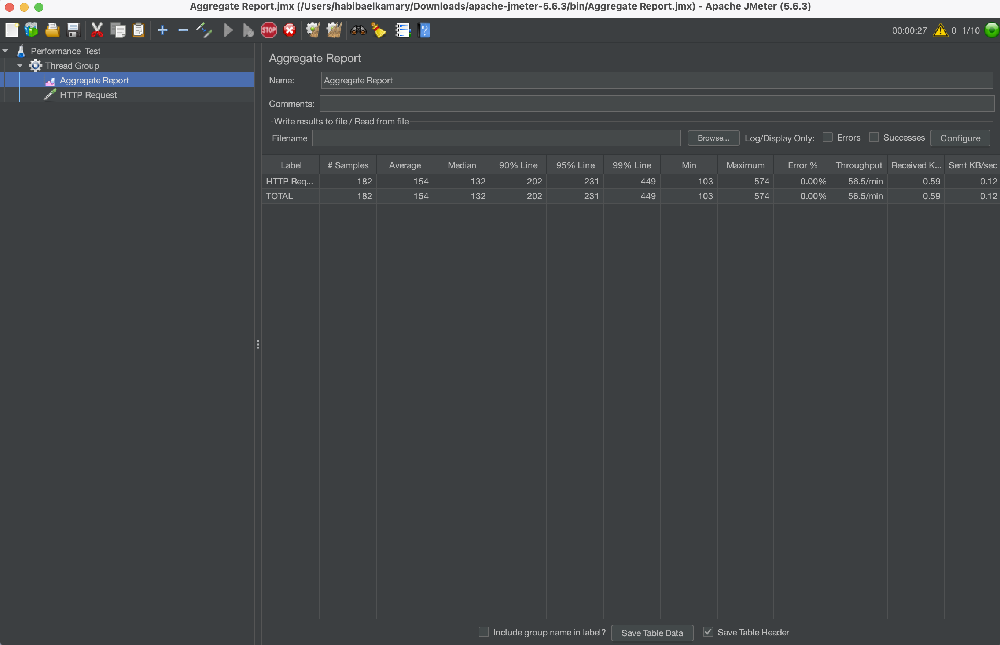
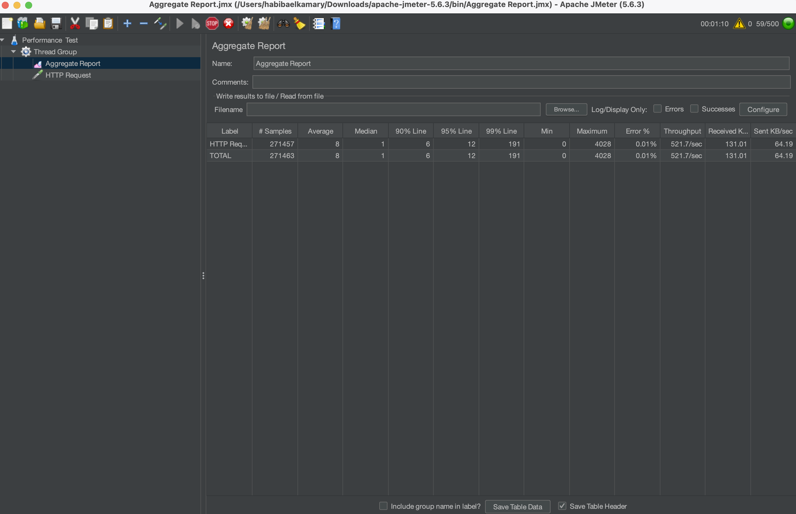
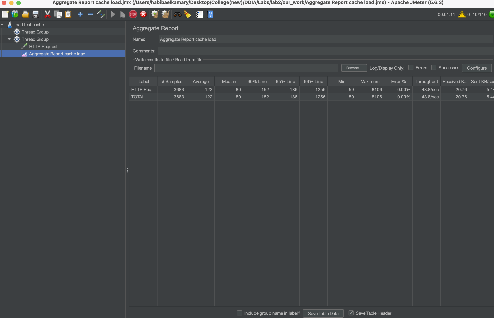
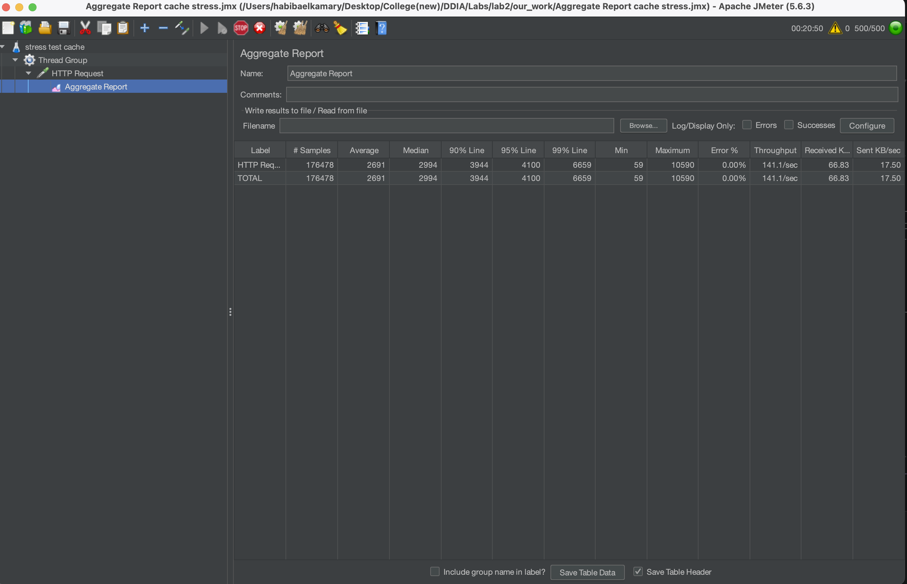
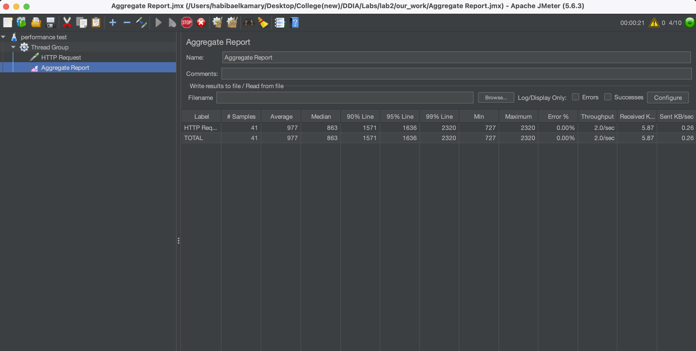
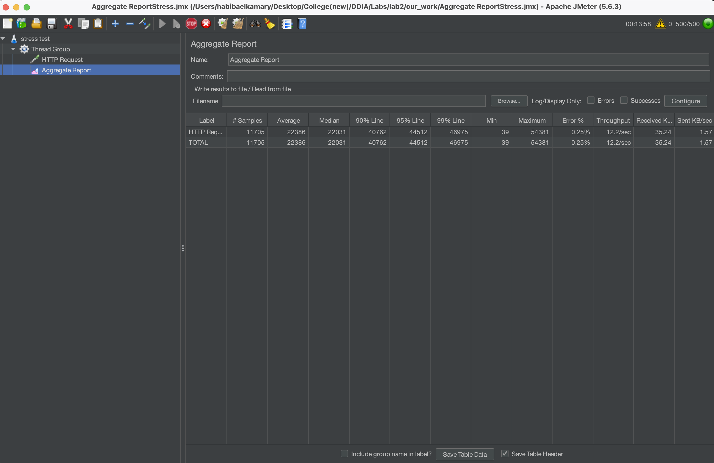

habiba marwan 8855<br>shahd yasser 8748

<h1 align="center"> DDIA Lab 2</h1>


#  Task A - Ratings Data Service(MySQL Integration)

## Overview

This service is part of a microservices system. It is responsible for:

* Storing user ratings in a database
* Providing ratings through REST API
* Registering itself with Eureka (service discovery)

In this task, the storage was changed from **in-memory data to MySQL database**.

---

# Database Setup

## Database Name

```sql
ratings_db
```

##  Create Database

```sql
CREATE DATABASE ratings_db;
USE ratings_db;
```

##  Table Schema

```sql
CREATE TABLE ratings (
    id INT AUTO_INCREMENT PRIMARY KEY,
    user_id VARCHAR(50),
    movie_id VARCHAR(50),
    rating INT
);
```


#  Project Structure
```
1. models
2. repository
3. resources
4. RatingsDataServiceApplication.java
```
---

#  Classes and Their Responsibilities

##  1. Rating.java (Entity)

* Represents a row in the database
* Maps Java object to MySQL table

Key features:

* `@Entity` → marks it as DB table
* `@Table(name = "ratings")` → links to table
* Fields mapped to columns (`user_id`, `movie_id`)
---

##  2. UserRating.java

* Wraps a list of ratings
* Used for API response

Example response:

```json
{
  "ratings": [...]
}
```

---

##  3. RatingRepository.java

* Interface for database operations

Key method:

```java
List<Rating> findByUserId(String userId);
```

This automatically generates SQL query:

```sql
SELECT * FROM ratings WHERE user_id = ?
```

---

##  4. RatingsResource.java (Controller)

* Handles HTTP requests

Endpoint:

```text
GET /ratings/{userId}
```

##  5. RatingsDataServiceApplication.java

* Main class (entry point)
* Starts Spring Boot application
* Registers service with Eureka

---

#  Application Workflow

1. Client sends request:

```text
GET /ratings/1
```
2. Controller receives request
3. Repository executes query:
```sql
SELECT * FROM ratings WHERE user_id = '1';
```
4. Data converted into `Rating` objects
5. Wrapped into `UserRating`
6. Returned as JSON response
---

#  How to Run

1. Run the discovery microservice
2. Run the ratings microservice
3. Test API
Open browser:

```text
http://localhost:8083/ratings/1
```

---

#  Expected Output

```json
{
  "ratings": [
    { "movieId": "100", "rating": 4 },
    { "movieId": "200", "rating": 3 },
    { "movieId": "300", "rating": 5 }
  ]
}
```

---

#  Performance & Stress Testing using JMeter

## Overview

Apache JMeter was used to evaluate system performance under different load conditions:

* **Performance Test:** Measures behavior under normal load  
* **Stress Test:** Pushes system to its limits  

---

##  Performance Test Configuration

Number of Threads (users): 100
Ramp-up period (seconds): 30
Loop Count: 10

# without MySQL:


# witH MySQL:


---

Number of Threads (users): 500
Ramp-up period (seconds): 20
Loop Count: 20

# without MySQL:

# witH MySQL:


### Observation

* System performs efficiently under moderate load  
* No failures observed  
* Minimal difference between MySQL and in-memory database under low load  

---

## Stress Test Configuration

Number of Threads (users): 8000
Ramp-up period (seconds): 5
Loop Count: 10


## Observations

* Response time increased under heavy load  
* Throughput reached a peak then stabilized  
* System remained stable initially  
* MySQL showed slightly higher latency than in-memory  

## Questions
When MySQL Is an Appropriate Choice
MySQL performs well in scenarios where:
1. The dataset is structured and relational
2. Complex queries (sorting, filtering) are required
3. Strong consistency is important
4. System load is moderate
When MySQL Is inappropriate:
1. High Throughput Systems: Struggles with extremely high request rates (millions/sec).
2. Low Latency Requirements: Query execution takes milliseconds, so it is not suitable for real-time systems requiring fast responses.
---

#  Task B - Caching the movieDB query results into monogoDB
## **overview**

    i modified the movie-info microservice, specificaly the MovieResource class to first try to get wanted movies from the omngo database and if not found (a cache miss) will then go to the movieDB api

## **steps**

1 - i created an interface that extend mongoRepository to allow me to talk to the monogoDB

```java
@Repository
public interface MovieRepo extends MongoRepository<MovieSummary, String> {}
```
2 - i edited the movieResources class to try fetching from mongo first

```java
package com.example.movieinfoservice.resources;

import com.example.movieinfoservice.models.Movie;
import com.example.movieinfoservice.models.MovieSummary;
import com.example.movieinfoservice.repository.MovieRepo;

import java.util.Optional;

import org.springframework.beans.factory.annotation.Value;
import org.springframework.web.bind.annotation.PathVariable;
import org.springframework.web.bind.annotation.RequestMapping;
import org.springframework.web.bind.annotation.RestController;
import org.springframework.web.client.RestTemplate;

@RestController
@RequestMapping("/movies")
public class MovieResource {

    @Value("${api.key}")
    private String apiKey;

    private RestTemplate restTemplate;
    private MovieRepo movieRepo;

    public MovieResource(RestTemplate restTemplate, MovieRepo movieRepo) {
        this.restTemplate = restTemplate;
        this.movieRepo = movieRepo;
    }

    @RequestMapping("/{movieId}")
    public Movie getMovieInfo(@PathVariable("movieId") String movieId) {

        // check MongoDB first
        Optional<MovieSummary> cachedMovie = movieRepo.findById(movieId);

        if (cachedMovie.isPresent()) {
            System.out.println("Fetching from MongoDB Cache...");
            MovieSummary summary = cachedMovie.get();
            return new Movie(movieId, summary.getTitle(), summary.getOverview());
        }

        // if not in cache, Get the movie info from TMDB
        System.out.println("Cache Miss. Calling TMDB API...");
        final String url = "https://api.themoviedb.org/3/movie/" + movieId + "?api_key=" + apiKey;

        try {
            MovieSummary movieSummary = restTemplate.getForObject(url, MovieSummary.class);

            // Save the result to MongoDB for next time and create movie object to display
            if (movieSummary != null) {
                movieRepo.save(movieSummary);
                return new Movie(movieId, movieSummary.getTitle(), movieSummary.getOverview());
            }
        } catch (Exception e) {
            // Handle API errors (e.g., movie not found)
            System.out.println(e);
            return new Movie(movieId, "Movie not found", "");
        }

        return new Movie(movieId, "Summary unavailable", "");
    }

}
```
## **The JMeter testing**

before adding the cache:

load testing with 10 users:


stress testing with 500 users:



After adding the cache
load testing with 10 users:


stress testing with 500 users:



## **Questions**
    Why did we suggest caching in this service, not other services? 
        because its the service that talks to the database of the project, and it would be recommended to create an intermediate cache between any service and its secondr storage


---

#  Task C - Creating a new Trending service with gRPC

## **overview**
i made the catalog service talk to the new trending movies service using grpc while the trending service itself fetches data from mysql and (mongo/movieDB api)

## **steps**
1 - i created a jpa repoistory that will allow my service to talk to mysql database and wrote my query manually

```java
public interface TrendingRepository extends JpaRepository<Rating,Integer> {
    @Query(value = "SELECT * FROM ratings ORDER BY rating DESC LIMIT 10", nativeQuery = true)
    List<Rating> findTrendingMovies();
}
```
2 - The data in mysql only return the movies ids so to display the movies itself i fetch the movies the same way as step B by calling the movie-info service using REST API

```java
for (Rating rating : trendingRatings) {

            String currentMovieId = rating.getMovieId();

            // the URL for your Movie Info Service
            String url = "http://localhost:8082/movies/" + currentMovieId;

            try {

                Movie movieDetails = restTemplate.getForObject(url, Movie.class);
            }
}
```
3 - To add the gRPC , first we need to define our interface using protobuff schema

```proto
syntax = "proto3";

option java_multiple_files = true;
option java_package = "com.example.trending";

// The message defining the movie details
message MovieInfo {
  string movieId = 1;
  string name = 2;
  string description = 3;
  int32 rating = 4;
}

// this is optional and in our case we don't need it
// The request message (empty if no parameters are needed)
message TrendingRequest {
  int32 limit = 1; 
}

// The response containing the list of top movies
message TrendingResponse {
  repeated MovieInfo movies = 1;        // repeated for a list
}

// The actual service definition
service TrendingService {
  rpc GetTrendingMovies(TrendingRequest) returns (TrendingResponse);
}
```
4 - we must run mvn clean compile to generate the needed classes and java code for our gRPC

5 - wrote the fuction at the trending service ( the response )

```java
@Override
    public void getTrendingMovies(TrendingRequest request, StreamObserver<TrendingResponse> responseObserver) {
        List<Rating> trendingRatings = trendingRepo.findTrendingMovies();
        // We use RestTemplate to call the other service
        RestTemplate restTemplate = new RestTemplate();

        // Start building the gRPC Response
        // it uses builder design pattrn so we create new instance like this
        TrendingResponse.Builder responseBuilder = TrendingResponse.newBuilder();
        // responseBuilder --> build the actual object in the response
        // responseObserver is used to send the obj over the network
        for (Rating rating : trendingRatings) {

            String currentMovieId = rating.getMovieId();

            // the URL for your Movie Info Service
            String url = "http://localhost:8082/movies/" + currentMovieId;

            try {

                Movie movieDetails = restTemplate.getForObject(url, Movie.class);

                if (movieDetails != null) {
                    // Convert Java object into a gRPC message
                    // .set are generated automatically for every field defined in schema
                    // .build converts this to the immutable obj that will be sent
                    MovieInfo info = MovieInfo.newBuilder()
                            .setMovieId(movieDetails.getMovieId())
                            .setName(movieDetails.getName())
                            .setDescription(movieDetails.getDescription())
                            .setRating(rating.getRating())
                            .build();

                    // Add this movie to the list in the response
                    // the add method was generated because we declared the response as repeated
                    // (list)
                    responseBuilder.addMovies(info);
                }
            } catch (Exception e) {
                System.out.println("Error calling Movie Info Service: " + e.getMessage());
            }

        }
        // Send the response back to the client (Catalog Service)
        responseObserver.onNext(responseBuilder.build());

        // Tell gRPC the call is finished
        responseObserver.onCompleted();
    }
```

6 - wrote the configurations needed at the catalog service (the client)

```java
package com.moviecatalogservice.services;

import com.example.trending.TrendingServiceGrpc;
import io.grpc.ManagedChannel;
import io.grpc.ManagedChannelBuilder;
import org.springframework.context.annotation.Bean;
import org.springframework.context.annotation.Configuration;

@Configuration
public class GrpcClientConfig {

    @Bean
    public TrendingServiceGrpc.TrendingServiceBlockingStub trendingStub() {
        ManagedChannel channel = ManagedChannelBuilder.forAddress("localhost", 9090)
                .usePlaintext()
                .build();
        return TrendingServiceGrpc.newBlockingStub(channel);
    }
}
```
7 - wrote the function for the request at the catalog service

```java
@RestController
@RequestMapping("/catalog")
public class MovieCatalogResource {

    private final RestTemplate restTemplate;

    private final MovieInfoService movieInfoService;

    private final UserRatingService userRatingService;

    @Autowired
    private TrendingServiceGrpc.TrendingServiceBlockingStub trendingStub;

    public MovieCatalogResource(RestTemplate restTemplate,
            MovieInfoService movieInfoService,
            UserRatingService userRatingService) {

        this.restTemplate = restTemplate;
        this.movieInfoService = movieInfoService;
        this.userRatingService = userRatingService;
    }

    /**
     * Makes a call to MovieInfoService to get movieId, name and description,
     * Makes a call to RatingsService to get ratings
     * Accumulates both data to create a MovieCatalog
     * 
     * @param userId
     * @return CatalogItem that contains name, description and rating
     */
    @RequestMapping("/{userId}")
    public List<CatalogItem> getCatalog(@PathVariable String userId) {
        List<Rating> ratings = userRatingService.getUserRating(userId).getRatings();
        return ratings.stream().map(movieInfoService::getCatalogItem).collect(Collectors.toList());
    }

    @RequestMapping("/trending")
    public List<CatalogItem> getTrendingMovies() {
        // Build the Request
        TrendingRequest request = TrendingRequest.newBuilder().setLimit(10).build();

        // Call the gRPC Service
        TrendingResponse response = trendingStub.getTrendingMovies(request);

        // Map the gRPC MovieInfo objects back to your CatalogItem model
        return response.getMoviesList().stream()
                .map(movie -> new CatalogItem(movie.getName(), movie.getDescription(), movie.getRating()))
                .collect(Collectors.toList());
    }
}
```

## **The JMeter testing**

before adding the cache:

load testing with 10 users:


stress testing with 500 users:


## **Questions**
    From which data source does this service fetch its data? Is this data
    source adequate for this service use case of it? Is there a method to
    improve the performance of the use case in this service?

        This will get data from mysql and (mongoDB/movieDB API)
        to improve:

            1 - Creating an index on the rating column in MySQL.
            2 - Pre-calculating the top 10 list on every change rather than calculating it on every request.